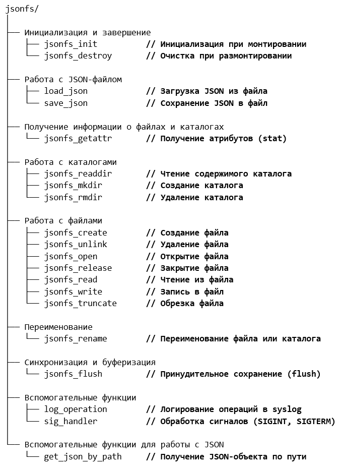

<p align="center">
  
</p>

<h1 align="center">JSON FS</h1>

<p align="center"><i>Файловая система на основе JSON-файла — через FUSE.</i></p>

---

## 📖 О программе

**JSON FS** — специализированная файловая система, разработанная 
с использованием технологии **FUSE (Filesystem in Userspace)**. 
Она позволяет работать с обычным **JSON-файлом** так, как если бы 
это была настоящая файловая система в Linux.

Просто укажите путь к JSON-файлу — и вы получите полноценное 
дерево файлов и папок, с которым можно работать через стандартные 
команды (`ls`, `cat`, `mkdir`, `rm`, `mv` и другие).

---

## ✨ Возможности

- 📂 **Прозрачная работа с JSON** — читайте и пишите как с обычными файлами.
- 🔧 **Стандартные операции** — `ls`, `cat`, `cp`, `mv`, `rm`, `mkdir`.
- ⚡ **Быстрый доступ** — JSON загружается в память целиком.
- 🔒 **Локально** — данные никуда не отправляются.
- 🐧 **Linux** — работает через FUSE.
- 🎯 **Автоматическое сохранение** — изменения сразу пишутся в файл.
- 🔐 **Скрытые ключи** — ключи, начинающиеся с `.`, не отображаются.

---

## 🎥 Демонстрация

[📥 Скачать полное видео (MP4)](Media/demo.mp4)

---

## 🎯 Принцип работы

JSON-файл воспринимается как **дерево каталогов и файлов**:

| JSON | Файловая система |
|------|------------------|
| Объект (набор ключей) | Каталог (папка) |
| Примитив (строка, число, bool) | Файл |

### Пример

**JSON:**
```json
{
  "documents": {
    "hello.txt": "Hello, world!"
  },
  "config": {
    "debug": true,
    "port": 8080
  }
}
```

Файловая система:

```text
/
├── documents/
│   └── hello.txt    (содержимое: "Hello, world!")
└── config/
    ├── debug        (содержимое: "true")
    └── port         (содержимое: "8080")
```

### Стандартные команды работают напрямую
- `mkdir` — создать новый раздел (объект JSON).

- `cat` — прочитать значение параметра.

- `echo "..." > filename` — изменить значение.

- `rm`, `rmdir` — удалить.

- `mv` — переименовать.

Все операции **автоматически** отражаются в JSON-файле.

---

## 🏗 Архитектура
**JSON FS** построен на двух библиотеках:

- **libfuse** — интерфейс файловой системы в пользовательском пространстве.
Перехватывает запросы ядра Linux и передаёт их программе.

- **libjansson** — библиотека работы с JSON на C.
Отвечает за загрузку, доступ и сохранение данных.

## Реализованные FUSE-функции

| Функция | Что делает |
|---------|-----------|
| `getattr` | Атрибуты файла/каталога |
| `readdir` | Содержимое каталога |
| `mkdir` | Создание объекта JSON |
| `create` | Создание файла |
| `open` / `read` / `write` | Открытие, чтение, запись |
| `unlink` / `rmdir` | Удаление |
| `rename` | Переименование |
| `truncate` | Обнуление |
| `flush` / `release` | Сохранение, освобождение |
| `init` / `destroy` | Монтирование/размонтирование |

**Модульная структура проекта:**



*Схема взаимодействия модулей JSON FS*

---

## ⚙️ Требования
- **Linux** (FUSE поддерживается ядром)

- **libfuse** — обычно уже установлен. Если нет:

```bash
sudo apt install libfuse2   # Ubuntu / Debian
sudo dnf install fuse       # Fedora
sudo pacman -S fuse2        # Arch
```

- **libjansson**:

```bash
sudo apt install libjansson4
```

---

## 📥 Установка
Скачайте готовый бинарник из **Releases**:

```bash
wget https://github.com/твой-ник/json-fs/releases/download/v1.0/jsonfs
chmod +x jsonfs
sudo mv jsonfs /usr/local/bin/
```

Или соберите из исходников:

```bash
git clone https://github.com/твой-ник/json-fs.git
cd json-fs
make
sudo make install
```

---

## 🎮 Использование
1. Создайте пустой JSON-файл
```bash
echo '{}' > my_storage.json
```
2. Смонтируйте его
```bash
mkdir /mnt/jsonfs
jsonfs my_storage.json /mnt/jsonfs
```
3. Работайте с ним как с файловой системой
```bash
cd /mnt/jsonfs
mkdir documents
echo "Hello, world!" > documents/hello.txt
cat documents/hello.txt
ls -la
```
4. Размонтируйте
```bash
fusermount -u /mnt/jsonfs
```
5. Проверьте JSON
```bash
cat my_storage.json
```

Увидите:

```json
{
  "documents": {
    "hello.txt": "Hello, world!"
  }
}
```


### 📋 Справочник команд

| Операция | Команда | Что делает |
|----------|---------|-----------|
| **Сборка** | `gcc -o jsonfs jsonfs.c -lfuse -ljansson -D_FILE_OFFSET_BITS=64` | Компилирует бинарник `jsonfs` |
| **Монтирование** | `./jsonfs /mnt/jsonfs test.json` | Подключает `test.json` как файловую систему |
| **Размонтирование** | `fusermount -u /mnt/jsonfs` | Отключает файловую систему |
| **Размонтирование (альт.)** | `sudo umount /mnt/jsonfs` | Альтернативный способ |

### 📁 Работа с каталогами

| Операция | Команда |
|----------|---------|
| **Создать каталог** | `mkdir /mnt/jsonfs/new_section` |
| **Создать вложенный каталог** | `mkdir /mnt/jsonfs/config/old_section` |
| **Несколько каталогов сразу** | `mkdir /mnt/jsonfs/config /mnt/jsonfs/config/section1 /mnt/jsonfs/config/section2` |
| **Просмотреть содержимое** | `ls /mnt/jsonfs/config` |
| **Переместить каталог** | `mv /mnt/jsonfs/config/old_section /mnt/jsonfs/new_section/old_section` |
| **Удалить пустой каталог** | `rmdir /mnt/jsonfs/config/section2` |
| **Удалить каталог рекурсивно** | `rm -r /mnt/jsonfs/config/section1` |

### 📄 Работа с файлами

| Операция | Команда |
|----------|---------|
| **Создать файл** | `cat > /mnt/jsonfs/config/timeout` |
| **Записать значение** | `echo "120" > /mnt/jsonfs/config/timeout` |
| **Прочитать файл** | `cat /mnt/jsonfs/config/timeout` |
| **Информация о файле** | `stat /mnt/jsonfs/config/timeout` |
| **Переименовать файл** | `mv /mnt/jsonfs/config/timeout /mnt/jsonfs/config/connection_timeout` |
| **Удалить файл** | `rm /mnt/jsonfs/config/timeout2` |

---

### 🚀 Полный сценарий работы

| Шаг | Действие | Команда |
|:---:|----------|---------|
| 1 | Собрать | `gcc -o jsonfs jsonfs.c -lfuse -ljansson -D_FILE_OFFSET_BITS=64` |
| 2 | Смонтировать | `sudo mkdir -p /mnt/jsonfs && ./jsonfs /mnt/jsonfs test.json` |
| 3 | Создать структуру | `mkdir /mnt/jsonfs/config && echo "120" > /mnt/jsonfs/config/timeout` |
| 4 | Проверить | `cat /mnt/jsonfs/config/timeout` → `120` |
| 5 | Размонтировать | `fusermount -u /mnt/jsonfs` |
| 6 | Проверить JSON | `cat test.json` → `{"config": {"timeout": "120"}}` |

---

## 💡 Зачем это нужно
JSON FS полезен для:
- 🗃 **Резервных копий** — структура папок в одном файле.

- 📊 **Логов** — писать данные как в файлы, а хранить как JSON.

- 🧪 **Тестирования** — эмуляция ФС без диска.

- 📝 **Заметок** — работа с JSON-базой через редактор.

- 🔄 **Обмена** — передача структуры папок одним файлом.

- 🛠 **Скриптов** — работа с JSON через привычные утилиты.

---

## 🔒 Особенности реализации
- **Загрузка в память** — JSON-файл загружается целиком при монтировании.

- **Кэширование изменений** — все изменения сначала в памяти, потом сохраняются.

- **Автосохранение** — при завершении (Ctrl+C) всё сохраняется автоматически.

- **Блокировка** — предотвращает одновременный доступ.

- **Скрытые ключи** — ключи с `.` в начале не отображаются.

- **Автотипизация** — при записи программа сама определяет тип (число, bool, null, строка).

---

## ❓ FAQ
### Работает ли на Windows?
Нет. FUSE — технология Linux. На Windows нужно использовать WinFSP —
но JSON FS это не поддерживает.

### Работает ли на macOS?
Теоретически — через macFUSE. Официально не тестировалось.

### Можно использовать в коммерческих целях?
Да. Проект под MIT License — свободное использование.

### Что будет с моими данными при сбое?
JSON-файл сохраняется автоматически. При правильном завершении — все данные целы.

### Как откатить изменения?
Программа не хранит историю. Используйте Git или бэкапы JSON-файла.

### Есть GUI?
Нет. Только командная строка.

---

## 📜 Лицензия
Проект распространяется под лицензией MIT. См. файл LICENSE.

Кратко: вы можете свободно использовать, изменять и распространять
JSON FS, включая коммерческое использование. Единственное требование —
сохранить уведомление об авторстве.

## 👤 Автор
Vecsai

Copyright (c) 2026 Vecsai. Распространяется под MIT License.

---

## ⚖️ Товарные знаки и отказ от ответственности

**JSON FS** — независимый опенсорсный проект. Он **не связан** ни с одной 
из компаний, чьи продукты упоминаются ниже, не спонсируется ими и не 
одобрен ими.

### Упоминания продуктов

**Linux** является зарегистрированным товарным знаком Linus Torvalds.

**FUSE** (Filesystem in Userspace) — свободное программное обеспечение, 
изначально разработанное для ядра Linux. Спецификация и эталонная 
реализация распространяются под лицензией **LGPL 2.1**. JSON FS 
использует FUSE через библиотеку `libfuse`, линкуясь с ней динамически, 
что соответствует условиям LGPL 2.1.

**Jansson** — библиотека для работы с JSON на языке C. Распространяется 
под лицензией **MIT**. JSON FS использует Jansson для парсинга и 
сохранения JSON-структур.

**Ubuntu**, **Debian**, **Fedora**, **Arch Linux** и другие названия 
дистрибутивов Linux являются товарными знаками их соответствующих 
владельцев (Canonical Ltd., Software in the Public Interest, Red Hat, 
Inc., Arch Linux и т.д.).

**Windows** является товарным знаком Microsoft Corporation.

**macOS** является товарным знаком Apple Inc.

**WinFSP** и **macFUSE** являются товарными знаками их соответствующих 
владельцев.

### Зависимости и их лицензии

JSON FS использует следующие сторонние библиотеки:

- **libfuse** — GNU LGPL 2.1
- **libjansson** — MIT License

### Отказ от ответственности

JSON FS распространяется «**как есть**», без каких-либо гарантий, 
явных или подразумеваемых, включая гарантии товарной пригодности 
и пригодности для конкретной цели.

**Автор не несёт ответственности за:**

- потерю данных, возникшую в результате сбоя питания, отключения 
  системы или ошибок пользователя;
- повреждение JSON-файлов при некорректном монтировании или 
  одновременном доступе;
- ущерб, возникший в результате использования программы;
- последствия использования JSON FS в производственных средах 
  без предварительного тестирования.

**Важно:** файловая система работает напрямую с вашими данными. 
Перед монтированием **обязательно делайте резервные копии** JSON-файлов. 
Автор не гарантирует сохранность данных при сбоях.

### Соответствие законодательству

Используя JSON FS, вы соглашаетесь соблюдать законодательство вашей 
юрисдикции. Автор не несёт ответственности за использование программы 
в целях, запрещённых законом.

Все остальные упомянутые названия продуктов являются товарными 
знаками их соответствующих владельцев.
